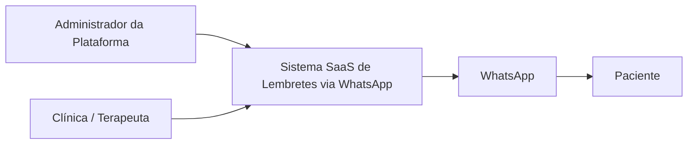
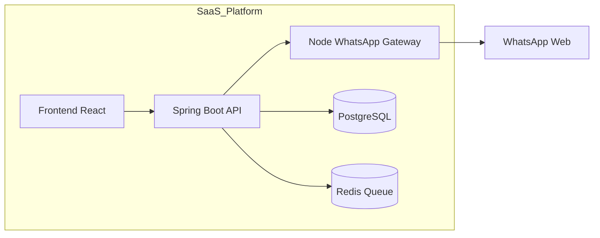
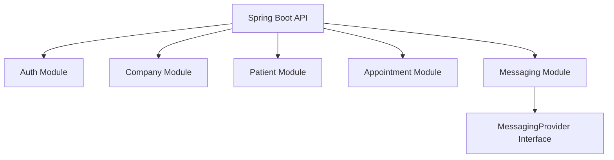
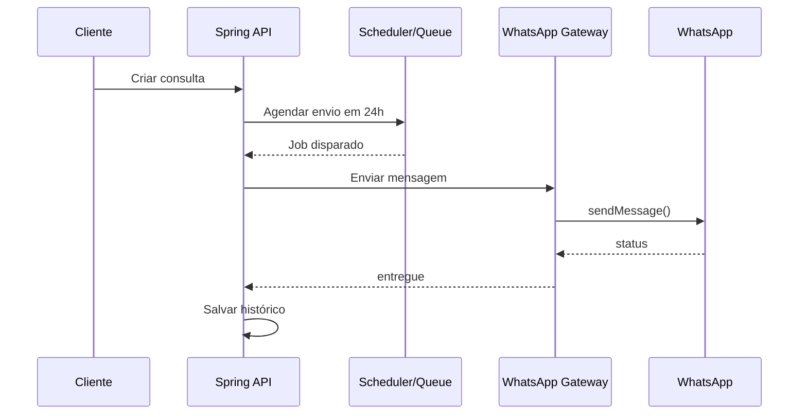
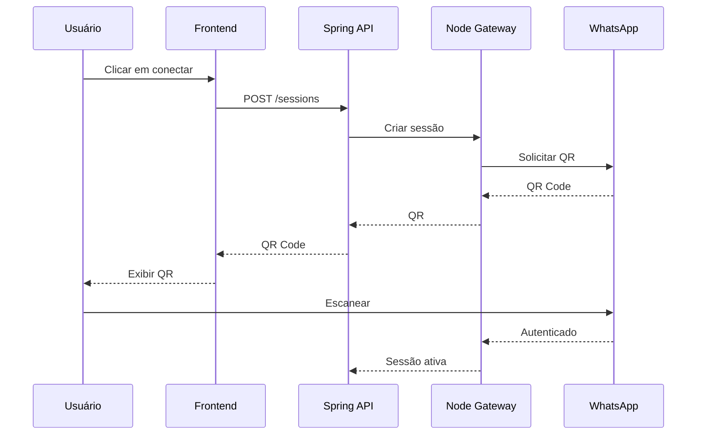
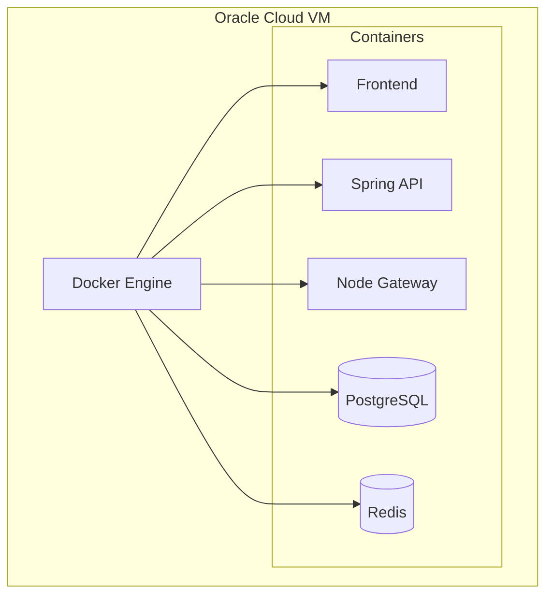

project-root/
 ├── backend/
 ├── frontend/
 ├── gateway/
 └── docs/
     └── sad.md


Este é o SAD v1.0 do meu sistema. Use-o como fonte de verdade e mantenha todas as decisões compatíveis com ele.

Você é o arquiteto de software deste sistema.
Nunca contradiga o SAD abaixo. 
Todas as sugestões devem ser compatíveis com ele.

# Software Architecture Document (SAD)

**Versão:** 1.0
**Status:** Aprovado para desenvolvimento inicial
**Data:** 2026-03-31

---

## 1. Introdução

Este documento descreve a arquitetura do sistema SaaS para envio automatizado de lembretes de consultas via WhatsApp. O objetivo é fornecer uma visão completa da estrutura, componentes, decisões técnicas e fluxos operacionais do sistema.

## 2. Escopo do Sistema

O sistema permite que clínicas, terapeutas e profissionais de saúde cadastrem pacientes e consultas, enviando automaticamente lembretes por WhatsApp 24 horas antes do horário agendado.

## 3. Definições e Acrônimos

* SaaS: Software as a Service
* API: Application Programming Interface
* QR Code: Código utilizado para autenticação no WhatsApp

## 4. Visão Geral da Arquitetura

A solução é composta por uma aplicação web, uma API principal, um gateway de mensageria WhatsApp, banco de dados e sistema de filas para agendamento de mensagens.

## 5. Stakeholders

* Administrador da plataforma
* Clientes pagantes (clínicas, terapeutas, dentistas)
* Pacientes (apenas receptores de mensagens)

## 6. Requisitos Funcionais

* Cadastro de usuários
* Login com Google
* Cadastro de pacientes
* Cadastro de consultas
* Integração com Google Calendar
* Envio automático de mensagens 24h antes
* Histórico de mensagens enviadas

## 7. Requisitos Não Funcionais

* Escalabilidade horizontal
* Isolamento entre empresas (multi-tenant)
* Segurança de dados e autenticação OAuth2
* Alta disponibilidade do serviço de mensageria

## 8. Visão de Contexto



O sistema interage com usuários finais e com o serviço externo WhatsApp para envio de mensagens.

## 9. Visão de Containers



* Frontend (React)
* API principal (Spring Boot – futuro)
* Gateway de mensageria (Node.js)
* Banco de dados PostgreSQL
* Redis para filas e agendamento

## 10. Componentes da API



### 10.1 Módulo de Autenticação

Responsável por login via Google e controle de acesso.

### 10.2 Módulo de Empresas

Gerencia dados de clínicas e planos de assinatura.

### 10.3 Módulo de Pacientes

Permite cadastro e manutenção de pacientes.

### 10.4 Módulo de Consultas

Gerencia agendamentos e integração com calendário.

### 10.5 Módulo de Mensagens

Responsável por gerar, agendar e registrar envios.

## 11. Arquitetura de Mensageria

O gateway Node.js gerencia sessões do WhatsApp, geração de QR Code e envio de mensagens. A API principal comunica-se com o gateway via REST.

## 12. Modelo de Dados

Principais entidades:

* Company
* User
* Patient
* Appointment
* Message
* WhatsAppSession

## 13. Fluxo de Envio de Lembrete



1. Usuário cria uma consulta
2. Sistema agenda um job
3. Sistema agenda um job
4. 24 horas antes, o job dispara
5. API solicita envio ao gateway
6. Gateway envia mensagem via WhatsApp
7. Status é registrado no banco

## 14. Fluxo de Autenticação WhatsApp



1. Usuário solicita conexão
2. Frontend solicita criação de sessão à API
3. Gateway gera QR Code
4. QR é exibido no frontend
5. Usuário escaneia com celular
6. Sessão é estabelecida e persistida

## 15. Infraestrutura e Implantação



O sistema é implantado em uma VM Oracle Cloud com Docker, contendo containers para frontend, API, gateway, banco e Redis.

## 16. Estratégia de Escalabilidade

* Uso de filas para desacoplar envio de mensagens
* Separação de gateway de mensageria
* Possibilidade futura de migração para API oficial da Meta

## 17. Estratégia de Migração Tecnológica

O sistema inicia em Node.js e migra gradualmente para Spring Boot, mantendo o gateway de mensageria como serviço isolado.

## 18. Segurança

* Autenticação via Google OAuth2
* Isolamento de dados por empresa
* Comunicação segura via HTTPS

## 19. Monitoramento e Logs

* Logs de envio de mensagens
* Logs de autenticação e erros
* Métricas de uso por empresa

## 20. Considerações Futuras

* Integração com API oficial do WhatsApp
* Sistema de billing automatizado
* Aplicativo mobile dedicado


# 📄 CONTEXTO COMPLETO DO PROJETO – AGEPRO V2

## 🧠 Visão Geral

Este documento resume todo o progresso realizado no desenvolvimento do sistema SaaS de envio de lembretes via WhatsApp, conforme definido no SAD (Software Architecture Document).

O objetivo é permitir continuidade do desenvolvimento em outro ambiente/chat sem perda de contexto.

---

# 🏗️ Arquitetura (Baseada no SAD)

Sistema composto por:

* API principal (Node.js → futura migração para Spring Boot)
* Gateway de WhatsApp (Node.js)
* Banco de dados PostgreSQL
* Redis (filas e agendamento)
* Frontend (futuro – React / Expo)

Comunicação:

```
Frontend → API → WA Gateway → WhatsApp
```

---

# 🐳 Infraestrutura

✔ Docker Compose configurado
✔ PostgreSQL rodando
✔ Redis adicionado (corrigido posteriormente)
✔ Serviços isolados

Portas customizadas utilizadas para evitar conflito com outros projetos.

---

# 📦 Gerenciamento de pacotes

✔ Uso de **pnpm workspace**

Estrutura:

```
root/
  api/
  wa-gateway/
  Docs/
```

✔ `node_modules` centralizado na raiz (comportamento correto do pnpm)

---

# 📁 Estrutura atual da API

```
api/src/
  server.ts
  routes/
    index.ts

  modules/
    messaging/
      messaging.controller.ts
      messaging.service.ts
      messaging.routes.ts
      messaging.types.ts

  types/
    http.types.ts
```

---

# 🧠 Padrão arquitetural adotado

Separação por responsabilidade:

* Controller → entrada HTTP
* Service → regra de negócio
* Routes → definição de endpoints
* Types → contratos (sem `any`)

---

# 🔐 Autenticação (Decisão Arquitetural)

Definido modelo híbrido:

* Login com Google OAuth2
* Login com email/senha (planejado)

Motivo:

✔ Melhor UX
✔ Facilita testes (Postman)
✔ Padrão de mercado

---

# 📜 Swagger (Spec First)

## ✔ API

Local:

```
Docs/api/swagger.yaml
```

Melhorias aplicadas:

* Separação por TAGS:

    * Auth
    * Company
    * Patients
    * Appointments
    * Messaging
    * WhatsApp Session

* Padronização de endpoints

* Uso de schemas reutilizáveis

* Segurança com bearerAuth (JWT)

Swagger acessível via:

```
http://localhost:3000/docs
```

---

## ✔ WA Gateway

Local:

```
Docs/wa-gateway/swagger.yaml
```

Endpoints documentados:

* POST /send
* POST /sessions
* DELETE /sessions
* GET /sessions/status
* GET /sessions/{id}/qr

Separação clara entre:

```
API → alto nível (negócio)
Gateway → baixo nível (infra WhatsApp)
```

---

# 📬 Postman

Collection criada e refatorada:

✔ Estruturada por módulos
✔ Variáveis globais:

```
baseUrl
token
patientId
appointmentId
sessionId
```

✔ Fluxos cobertos:

* Auth
* Company
* Patients (CRUD)
* Appointments (CRUD)
* Messaging
* WhatsApp Sessions

---

# 🔗 Integração API ↔ Gateway

✔ Comunicação via REST
✔ Uso de variável:

```
WA_GATEWAY_URL=http://localhost:3001
```

✔ Testado e funcionando

Erro resolvido:

* 404 → rota incorreta
* método GET/POST incorreto
* variável de ambiente não definida

---

# 🧱 Módulo implementado: Messaging

## Estrutura:

```
messaging/
  controller
  service
  routes
  types
```

## Tipos criados (sem any):

```
SendMessageRequest
SendMessageResponse
GatewaySendMessageResponse
```

## Fluxo:

```
POST /messages/send (API)
   ↓
Service chama gateway
   ↓
POST /send (Gateway)
   ↓
Resposta tratada
```

---

# ⚠️ Decisões importantes tomadas

✔ Uso de Spec First (Swagger como fonte de verdade)
✔ NÃO usar Prisma models diretamente na API (separação de camadas)
✔ Tipagem forte (sem any)
✔ Arquitetura modular desde o início
✔ Separação entre API e Gateway

---

# 🚫 O que ainda NÃO foi implementado

* Auth (email/senha)
* Integração real com WhatsApp
* Banco de dados (modelagem + Prisma)
* Sistema de filas (Redis/BullMQ)
* Integração com Google Calendar
* Multi-tenant completo
* Frontend

---

# 🎯 Próximos passos recomendados

Ordem sugerida:

1. Implementar módulo Auth (com tipagem)
2. Integrar JWT
3. Criar módulo Patient completo com persistência
4. Introduzir Prisma (com separação de DTOs)
5. Implementar fila com Redis
6. Integrar Google Calendar
7. Evoluir Messaging para envio real

---

# 🧠 Padrões obrigatórios a manter

* ❌ NÃO usar `any`
* ✔ Sempre criar `types.ts` por módulo
* ✔ Controller sem regra de negócio
* ✔ Service sem dependência de Express
* ✔ Seguir Swagger como contrato

---

# 📌 Observações finais

Este projeto já está em um nível acima de um CRUD simples.

Ele segue conceitos de:

* Arquitetura modular
* Microserviços (gateway separado)
* Spec First API Design
* Tipagem forte (TypeScript)
* Preparação para escala (SaaS multi-tenant)

---

# 🚀 Status atual

```
Base arquitetural: ✔ COMPLETA
Documentação: ✔ COMPLETA
Infraestrutura: ✔ FUNCIONAL
Primeiro módulo: ✔ IMPLEMENTADO

Pronto para desenvolvimento real
```

---

**FIM DO DOCUMENTO**
